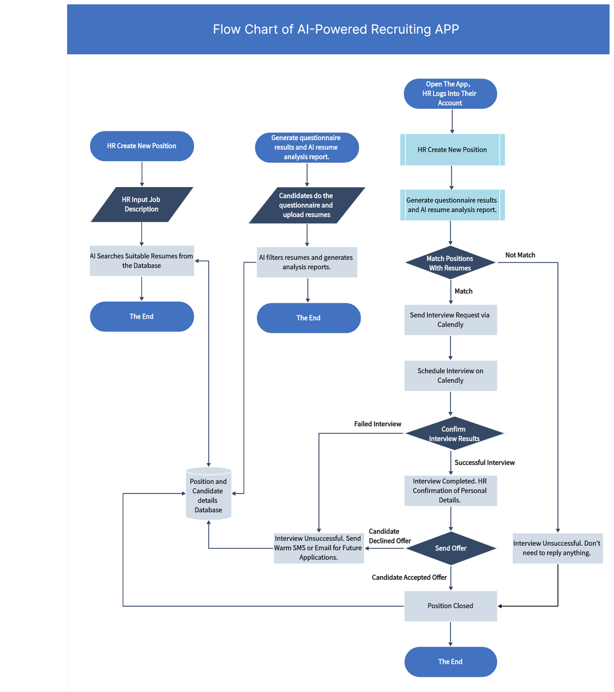
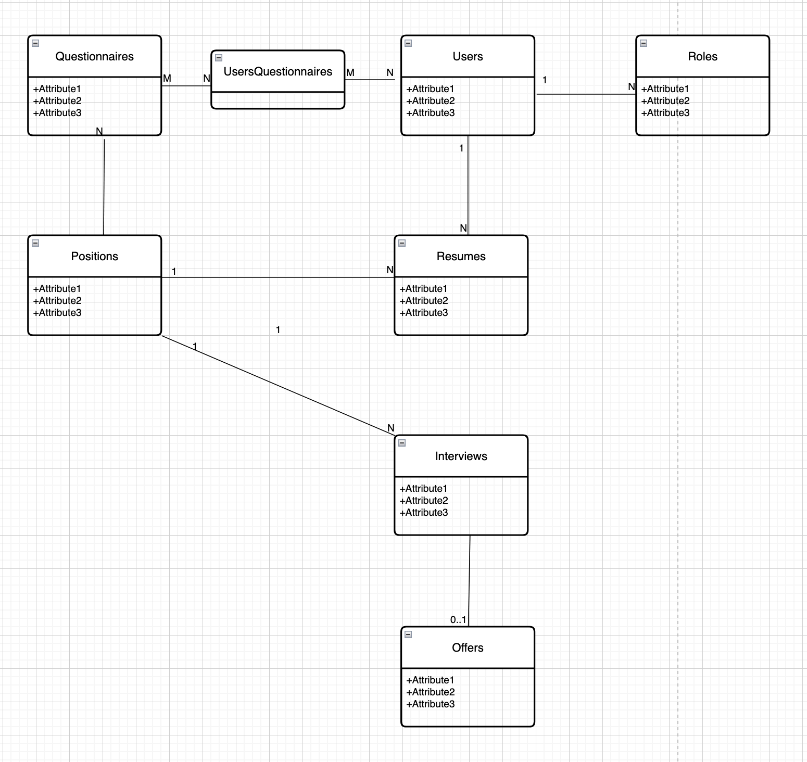

# Software Developement

- SDLC
- Agile(Scrum)
- Kanban
- Lean

## Agile

The common workflow

- 1-2 weeks sprint
- Sprint planning
- Sprint review
- Sprint retrospective
- Sprint backlog

Tools:

- Jira
- Trello
- GitHub
- Confluence
- Slack
- Microsoft Teams(Zoom, Google Meet)

## AI Resume Matcher

### Tech stacks

- Next.js
- React
- Tailwind CSS
- TypeScript
- PostgreSQL
- Prisma
- NextAuth.js
- Lucide Icons
- Shadcn
- Google OAuth
- Calendly
- ChatGPT
- Ant Design

### Requirement

The main functionalities of the current project are divided into three areas:

- UI: Information collection and an applicant-based information list.
- ChatGPT: Resume upload and job match analysis based on ChatGPT.
- Calendly: Interview scheduling and email notifications.

The workflow of the project is as follows:

### The Schema Design

The attributes: TODO
