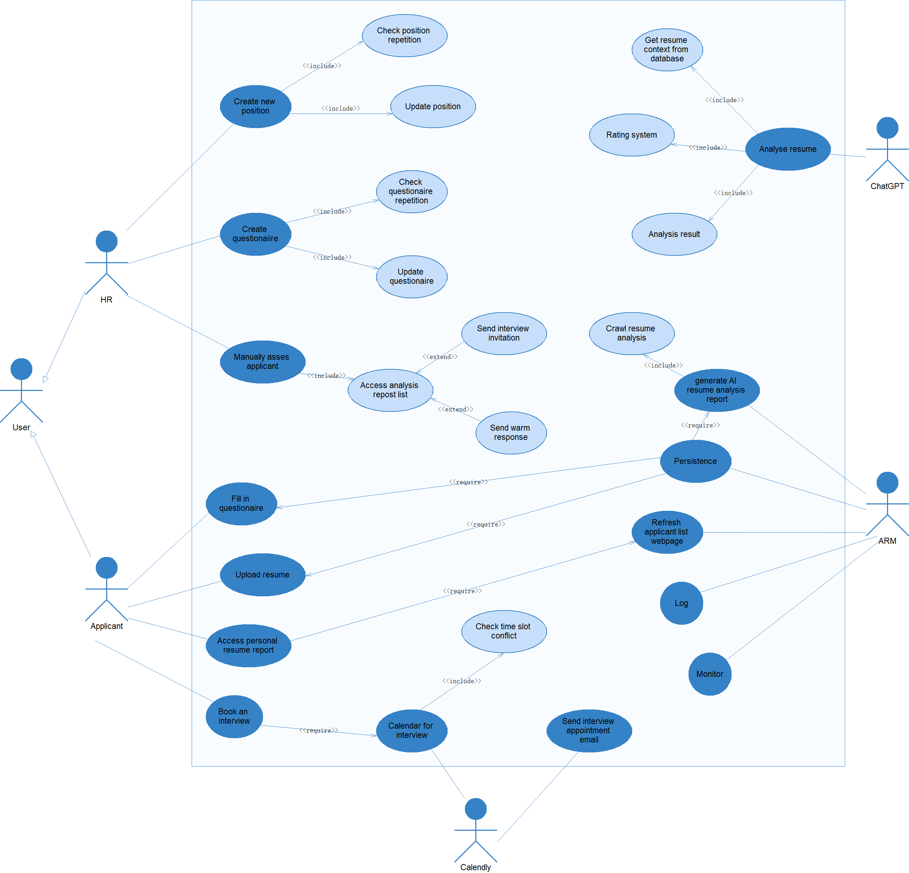

# Software Developement

- SDLC
- Agile(Scrum)
- Kanban
- Lean

## Agile

The common workflow

- 1-2 weeks sprint
- Sprint planning
- Sprint review
- Sprint retrospective
- Sprint backlog

Tools:

- Jira
- Confluence
- Trello
- GitHub
- Confluence
- Slack
- Microsoft Teams(Zoom, Google Meet)

We often use Confluence to document the project and Jira to manage the project. Conflunce is used to write wiki and documentation. Jira is used to manage the project and track the progress.

## Scrum

- Scrum Master
- Product Owner
- Development Team

## Kanban

- Kanban board
- WIP limit
- Flow

## AI Resume Matcher

### Tech stacks

- Next.js
- React
- Tailwind CSS
- TypeScript
- PostgreSQL
- Prisma
- NextAuth.js
- Lucide Icons
- Shadcn
- Google OAuth
- Calendly
- ChatGPT
- Ant Design

### Environments

- dev
  - development environment for developers
- qa
  - testing environment for QA. qa branch merges dev
- stage
  - pre-production environment for staging. Stage merges qa
- main
  - production environment for users. main merges stage.

### Guideline

- Documentation
  - Description
  - Requirement
  - Design
  - Reference
- Code Guideline
  - Code Style
  - Code Review
  - Security Check
- Testing
  - Unit Test
  - Integration Test
  - E2E Test
  - Performance Test
  - Security Test
- Deployment
  - CI/CD
  - Deployment Strategy
    - Manual
    - Automated
  - Monitoring
  - Backup

### Requirement

The main functionalities of the current project are divided into three areas:

- UI: Information collection and an applicant-based information list.
- ChatGPT: Resume upload and job match analysis based on ChatGPT.
- Calendly: Interview scheduling and email notifications.

The workflow of the project is as follows:

### The Schema Design

The attributes: TODO
